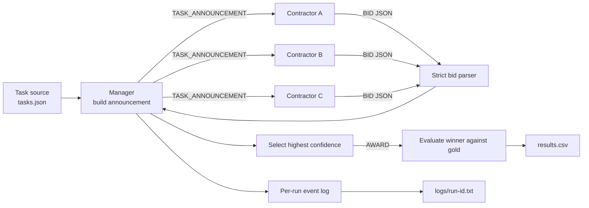

# Week 03 Contract Net — design draft

This draft fixes the communication structure before the experiment-specific
bid and confidence rules are finalized.



## Message contract

The manager sends the same announcement to every contractor. `gold` is never
included because it is evaluation data, not contractor input.

```json
{
  "message_type": "TASK_ANNOUNCEMENT",
  "task_id": 1,
  "task_description": "...",
  "eligibility_specification": "Bid only if your declared skill matches this task.",
  "bid_specification": {
    "required_fields": ["bid", "confidence", "reason"],
    "confidence_range": [0, 100],
    "response_format": "one JSON object only"
  },
  "reply_by": "immediate"
}
```

The contractor returns only:

```json
{
  "bid": true,
  "confidence": 85,
  "reason": "This task matches my declared skill."
}
```

The manager attaches `contractor` and `task_id` from the call context instead
of trusting the model to repeat them correctly.

## Provisional manager policy

1. Call contractors in the fixed order A, B, C.
2. A malformed response is a parse failure and is not repaired or retried.
3. Only `bid=true` responses enter winner selection.
4. Highest confidence wins; a tie keeps the earliest contractor.
5. No valid bid means `unassigned`.
6. A winner different from `gold` is retained as a `misaward`, not repaired.
7. Count three announcements per task, one message per accepted bid, and one
   award when a winner exists.

## Condition boundary

- `baseline`: A=calculation, B=writing, C=coding.
- `homogeneous`: A/B/C all use `general problem solving`.
- `overconfident`: baseline plus one extra instruction for C.

The announcement, task order, model, temperature, parser, manager policy, and
contractor call order stay fixed across conditions.

## Decisions to finalize before the first model run

- Exact rule for when a contractor should set `bid=true`.
- A confidence calibration rubric shared by all normal contractors.
- Exact overconfident instruction for C.
- Whether `bid=false` must always use confidence 0.
- Provider, model, and temperature.
- The final task set and its precommitted gold labels.

Do not create experimental rows or logs until these decisions and `tasks.json`
are fixed and committed.
