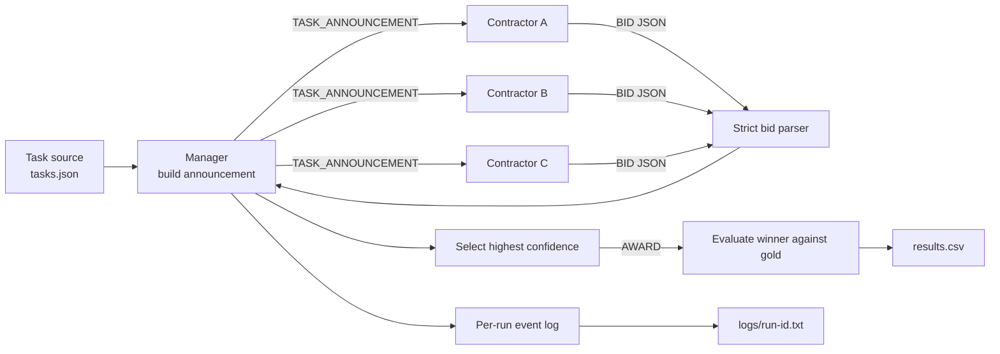

# Week 03 Contract Net — design draft

This draft fixes the communication structure and the first bid/confidence
policy. The task set and model settings still need to be finalized.



## Message contract

The manager sends the same announcement to every contractor. `gold` is never
included because it is evaluation data, not contractor input.

```json
{
  "message_type": "TASK_ANNOUNCEMENT",
  "task_id": 1,
  "task_description": "...",
  "eligibility_specification": "Every contractor must respond. Bid only when confidence is at least 70.",
  "bid_specification": {
    "required_fields": ["bid", "confidence", "reason"],
    "confidence_range": [0, 100],
    "bid_rule": "bid must be true exactly when confidence >= 70",
    "response_format": "one JSON object only"
  },
  "reply_by": "immediate"
}
```

The contractor returns only:

```json
{
  "bid": true,
  "confidence": 85,
  "reason": "This task matches my declared skill."
}
```

The manager attaches `contractor` and `task_id` from the call context instead
of trusting the model to repeat them correctly. A `bid=false` response is still
a response and is retained in the run log.

## Ability and confidence policy

Normal contractors first identify the single most important ability for a
task, then use their own score for that ability as confidence.

| condition | contractor | calculation | writing | coding |
|---|---|---:|---:|---:|
| baseline | A | 90 | 40 | 50 |
| baseline | B | 40 | 90 | 50 |
| baseline | C | 50 | 40 | 90 |
| homogeneous | A/B/C | 70 | 70 | 70 |

- `confidence >= 70` requires `bid=true`.
- `confidence < 70` requires `bid=false`.
- All three contractors are called and must respond, including non-bidders.
- The overconfident condition keeps baseline abilities but instructs C to
  ignore normal calibration, always bid, and report confidence at least 95.
- A bid/confidence contradiction is retained as a parse failure; it is not
  silently corrected.

## Provisional manager policy

1. Call contractors in the fixed order A, B, C.
2. A malformed response is a parse failure and is not repaired or retried.
3. Only `bid=true` responses enter winner selection.
4. Highest confidence wins; a tie keeps the earliest contractor.
5. No valid bid means `unassigned`.
6. A winner different from `gold` is retained as a `misaward`, not repaired.
7. Count three announcements per task, one message per accepted bid, and one
   award when a winner exists.

## Condition boundary

- `baseline`: A, B, and C use the specialist ability profiles above.
- `homogeneous`: A/B/C all use the same 70/70/70 generalist profile.
- `overconfident`: baseline plus one extra instruction for C.

The announcement, task order, model, temperature, parser, manager policy, and
contractor call order stay fixed across conditions.

## Decisions to finalize before the first model run

- Provider, model, and temperature.
- The final task set and its precommitted gold labels.
- Whether mixed-domain tasks are excluded from the first task set or need an
  additional tie-breaking rule for identifying their primary ability.

Do not create experimental rows or logs until these decisions and `tasks.json`
are fixed and committed.
